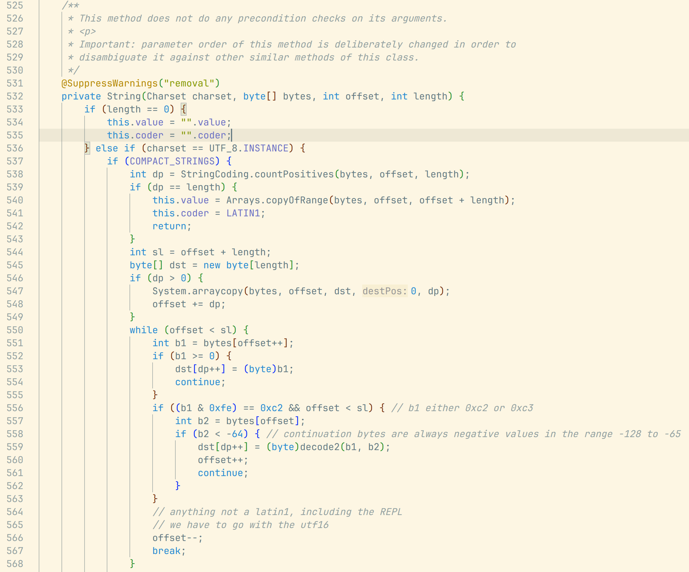
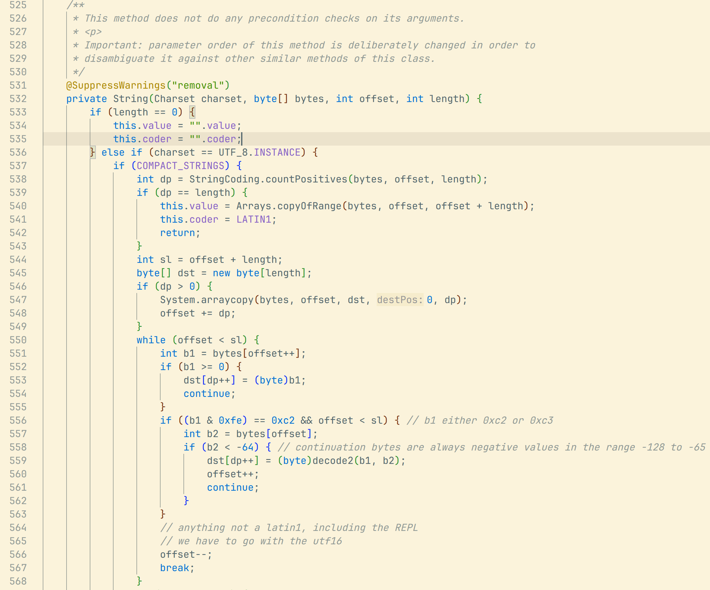
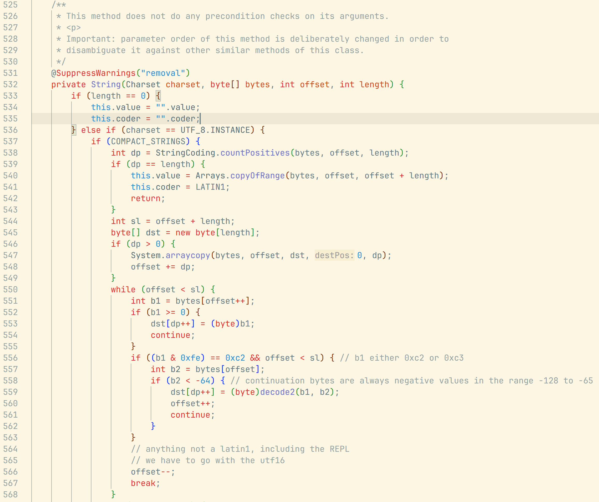
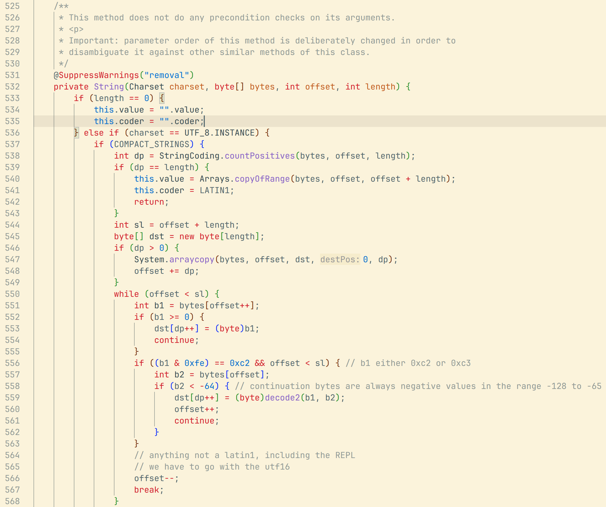

# solarized-light-extras theme pack
A fork of the default Solarized Light and custom Selenized Light(https://marketplace.visualstudio.com/items?itemName=ginfuru.ginfuru-better-solarized-dark-theme) themes with code highlighting from IntelliJ and Github

## Motivation

As a long time fan of Solarized Light theme I was looking for ways to make it even better. Then I stumbled upon the 
[Selenized Light](https://github.com/jan-warchol/selenized) theme which aspires to be a more readable version of 
Solarized Light. However I found the syntax higlighting for the default Selenized Light as well as Solarized Light 
themes to be unsatisfactory. 
So I decided to combine the Solarized Light and Selenized light themes with Syntax highlighting from IntelliJ and from 
Github. I didn't build the dark versions of these themes because I find them painful on the eyes.

## What's included

* Solarized Light IntelliJ theme
  
* Selenized Light IntelliJ theme
  
* Solarized Light Github theme
  
* Selenized Light Github theme
  

## Supported languages

* Java
* Python
* Javascript
* Typescript
* Properties
* Css
* Json
* Yaml
* Rust
* Xml
* and many others!

**Enjoy!**
